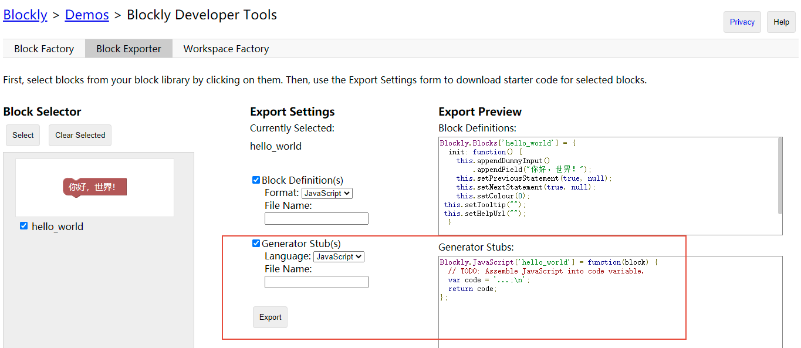
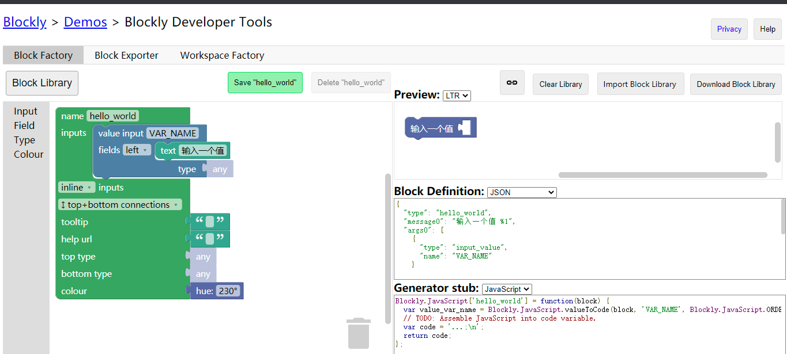
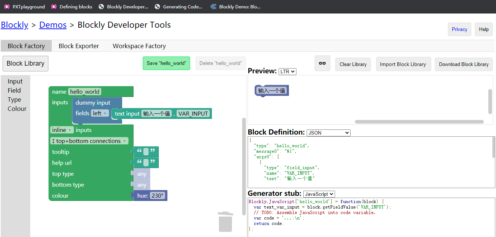
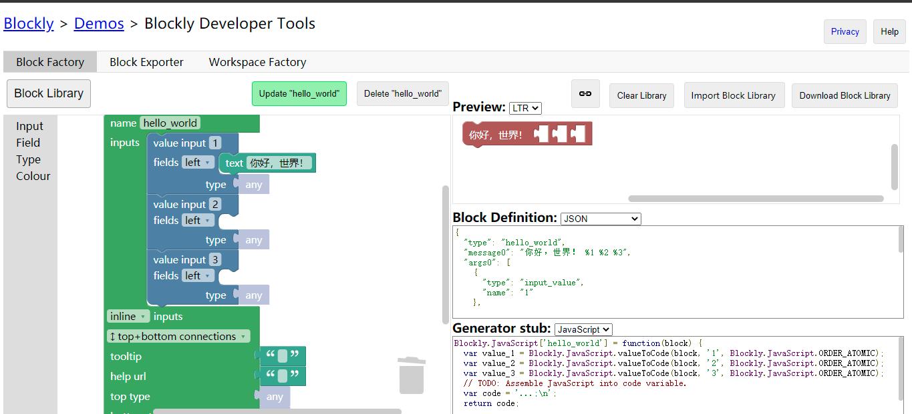
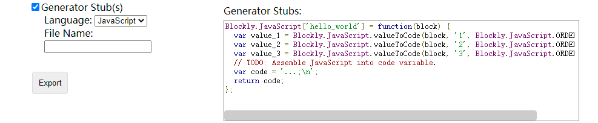

# 积木代码生成器开发 第七

### 专有名词解释

实现一个积木，需要两部分代码。一是外观部分，定义了积木上的文字，输入与输出，以及可能的外观变形。二是代码生成器部分。示例项目的“转换”按钮，把用户在 `WorkSpace` 内搭建的项目转换成一段 `JavaScript` 代码。用以将一块积木转变为一段代码字符串的代码，称之为 `Code Generator` 。

所有的积木理论上都可以有多个代码生成器，每个对应一种语言，`Blockly` 自带了 `JavaScript Lua Dart PHP Python` 这五种语言。可以看到每一块原生积木都有五个生成器。本教程只演示 `JavaScript` 语言代码生成器的使用。也可以注册新语言，不过本教程不会提及。

代码生成器本身只能用 `JavaScript` 编写。

### 预设的 Generator 代码

事实上，定义积木外观时，就已经得到了一个预设好的 `Generator` 。

这个预设的 `Generator` 很有用。



如图的红框就是预设的 `Generator` 。

### Generator 访问输入值

首先，输入值有两种。





第一张图是一个 `Value Input` 。第二张图是一个 `Field Input`。

其区别在于，第一张图的输入可以是一串有返回值的方法，而第二张图必须由用户在浏览器内打字输入。



事实上，一个积木可以有很多个输入。为了区别这些输入，每一个输入都要有一个 `Name` 作为标记。通过 `Name` 可以访问这个输入的值。`Dummy Input` 也可以拥有名字，只不过不常用。编写高级积木时，如果需要动态添加、去除 `Dummy Input`，才会需要它作为标记。



这个输入的值，已经写在了预设代码里。照抄即可。

事实上，预设代码会生成所有获取 `Field Input`、`Value Input`、`DropDown` 的值的代码。只需要调用这些变量。最终拼接为一个字符串即可。`Statement` 积木需要在字符串末尾加上换行。

如果积木是 `Statement`，直接返回字符串。

如果积木是 `Reporter` ，则需要返回数组，第一项为字符串，第二项为运算顺序等级。运算顺序等级，实质上是用来恰当添加括号的。 `1 + 2 * 3` 和 `(1 + 2) * 3` 的运算结果是不同的。同理，一些逻辑运算符执行也有先后。当然，如果没有这些美化代码的需求，直接让所有 `Reporter` 积木全加上括号，就可以解决多数情况。对生成 `JavaScript` 代码的代码生成器而言，全加括号只需要返回 `Blockly.JavaScript.ORDER_NONE` 即可。

### 正确使用自定义函数

有一个所谓缓存参数的概念，实质上是使用了自定义函数功能。自定义函数即首先在文件的最开头加上一段函数 `function(...) {...}` 。可以在最终返回的代码里调用这个函数。如原生积木中的混合颜色积木，就提供了 `colorBlend` 函数。

使用函数的好处主要在于可以在 `Reporter` 积木中进行一些 `Statement` 调用和缓存参数。

比如要使用 `Java` 中的 `INetSocketAddress` 类型的对象获取 `IP` 字符串，就可以这么写：

```
var functionName = Blockly.JavaScript.provideFunction_("iNetSocketAddress_toString", [
    "function " + Blockly.JavaScript.FUNCTION_NAME_PLACEHOLDER_ + "(iNetSocketAddress) {",
    "  var hostStr = iNetSocketAddress.getHostString();",
    "  var portStr = iNetSocketAddress.getPort();",
    "  var ret = hostStr + ':' + portStr;",
    "  return ret;",
    "}",
]);
code = functionName + "(" + ... + ")";
```

另外一个好处在于，同一个 `INetSocketAddress` 类型的对象可以多次复用。假设这个对象是调用某个耗时方法得到的（即省略号位置处是一个对函数的调用），那么缓存参数可以提高效率。假设这个对象和随机有关，如生成随机长度列表，那么不缓存会造成错误。

### 全部代码的生成

将 `workspace` 内积木转换为 `JavaScript` 代码，只需要这样写：

```
 Blockly['JavaScript'].workspaceToCode(workspace);
```

可以使用非原生支持的语言，但是必须为所有用到的积木都写代码生成器。
