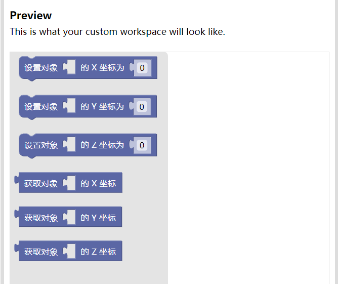

# 积木开发进阶 第九

这一章节的难度与前八章存在鸿沟，需要至少掌握 `Blockly Developer Tools` 的使用，并拥有一定的积木开发经验，最好在 `StackOverFlow` 或 `Google Blockly` 的官方 `Forum` 内浏览过一些开发上的问题，并研究过原生积木中比较复杂的（拥有 `Mixin Extension` 或 `Mutator` 的，如列表的部分积木）源码后再来阅读。

右文八章中的所有代码，足以完成一个 `Blockly` 代码编辑器的雏形。但如果仅用这样的代码实现积木，可能最后就会有这样的项目：

诚然，这些积木确实能正常工作，但是比之这块积木则相形见绌。

这一块积木，可以在 `Statement` 和 `Reporter` 之间变形。并且集 `X Y Z` 于一身。它是通过恰当的 `Mutator` 实现的。实现这样的积木有很多种办法，原生实现是 `lists_getIndex` 积木，在 `StackOverFlow` 等平台也有许多人发表过自己的实现。此处余提供一种实现。源码位于示例项目 `location_propmod` 积木中。

\
