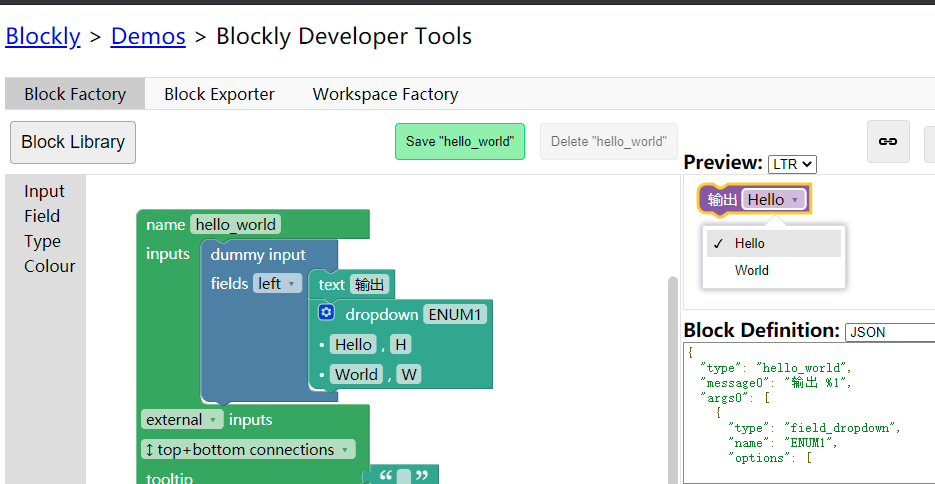

# 积木外观开发上 第五

`WorkSpace` 注入后应当添加积木。按顺序先定义积木外观，再完成代码生成器，最后将积木置于 `ToolBox` 中。`Blockly Developer Tools` 提供较直观地开发积木的方法。

官方教程：[https://developers.google.com/blockly/guides/create-custom-blocks/define-blocks](https://developers.google.com/blockly/guides/create-custom-blocks/define-blocks)

`Developer Tools` ：[https://developers.google.com/blockly/guides/create-custom-blocks/blockly-developer-tools](https://developers.google.com/blockly/guides/create-custom-blocks/blockly-developer-tools)

足下可以在 `Block Factory` 中自由搭建积木外观，认识一些基础语法。

## 积木类型

上方的方块被称为 `Reporter Block` ，特点是输出一个返回值。这一说法出自 `MicroSoft PXT` 文档。`Blockly` 并不使用这一名词，一般直接称该积木拥有 `Output` 。返回值可以有类型也可以不指定。原生类型包括布尔值、数字、字符串、列表。可以传入一个字符串以自定义类型。类型既可以是字符串也能是字符串列表。具体的类型判断将在左文细述。

上方的方块被称为 `Statement Block` ，特点是没有返回值，可以看作是 `void` 函数，没有输出。

`Inputs` 规定输入是内联还是外联，单行尽可能内联，多行可以外联。

具体效果见上，`external` 为外联（第一个），`inline` 为内联（第二个）。

连接形式，如为 `Reporter`，请使用 `left output` 。

如为 `Statement` 请使用 `top bottom connection` ，这样积木上下两侧都可以连接其他积木。上方第一个积木是 `top bottom connection` 的示例。

如果需要编写“终止循环”或者“返回 ( `return` )”这类积木，那么积木下方不需要连接其他积木，也就不需要底部的 连接。（直接跳出循环，那么这块积木底下的代码无意义。返回代表函数的逻辑分支到终点，也直接拒绝在下方连接任何积木。示例在右上。）

上下方连接都可以指定连接类型，所有原生积木都默认不指定。

`tooltip` 规定鼠标悬停时的描述，可以对功能进行中文翻译。

`help url` 规定跳转的网站。（右键积木，点击 `Help` 后跳转）

`colour` 规定积木颜色。左文将会再次提及颜色的修改。

## 输入

上面展示的就是三种 `Input` 形式。

其中 `Value Input` 为接受指定类型 `Reporter` 积木的输入。类型可以留空，可以是一种，也可以是一个列表。默认的连接处理方式是：`output` 和 `input` 任意一项为空则允许连接，如果二者均非空，则判断是否有重合，如有则允许连接。当然，连接处理可以通过插件自定义。见左文。

`Statement Input` 为接受任意 `Statement` 的一种输入。

`Dummy Input` 相当于没有任何输入，仅仅只是可以用来加 `Field` 或者文字。

以上是一个 `Dropdown Field`，可以看作是一个返回值对用户无意义的枚举。（用户只关心下拉后的功能，下拉的结果没有意义）。

需要注意，请尽可能少用 `Field` 中的 `Text Input` 或 `Numeric Input` ，应当直接使用 `Value Input` 。

以 `Text Input` 为例，它仅仅接受用户直接将字符串输入一个框中，但是如果字符串是一个变量，或字符串是由 `Reporter` 积木所返回的，就无法嵌入这个框当中，如下所示。同理，少用直接的数字输入。但是可以使用 `CheckBox` 和颜色输入（ `RGB` ）。

### 积木导出

导出积木时：

第一步，切换到 `Block Exporter` 。（先按 `Save` 保存现有积木）

第二步，把 `Block Definitions` 和 `Generator` 全部切换为 `JavaScript` 。

第三步，把 `Block Definitions` 和 `Generator` 的全部内容都黏贴进某个 `.js` 文件中。

第四步，切换到 `Block Factory` ，并 `DownLoad Block Library` 。

可以这样理解，在 `Developer Tools` 里写的积木，都是以 `XML` 的形式保存的，一定程度上相当于源代码。将源代码编译产生的是 `.js` 文件。为应对下次再导入修改的情况，建议导出 `XML` 。

在示例项目中将不会包括导出的 `XML` 。示例积木在 `customblocks.js` 内。

### 积木导入

第一步，找到 `XML` 文件。

第二步，上传到 `Blockly Developer Tools`（右侧 `Import Block Library` ）。

第三步，按左侧 `Block Library`，`Create New Block` 。然后进行开发。
