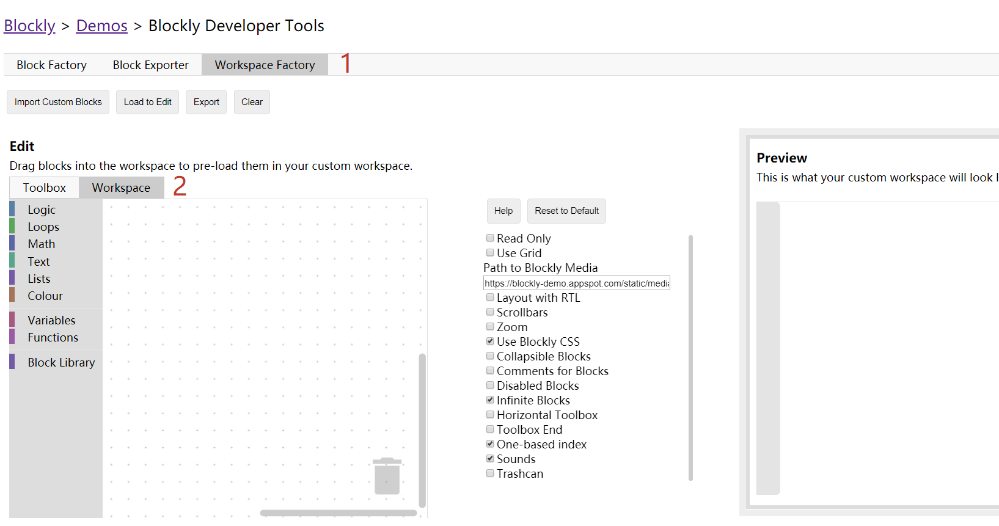
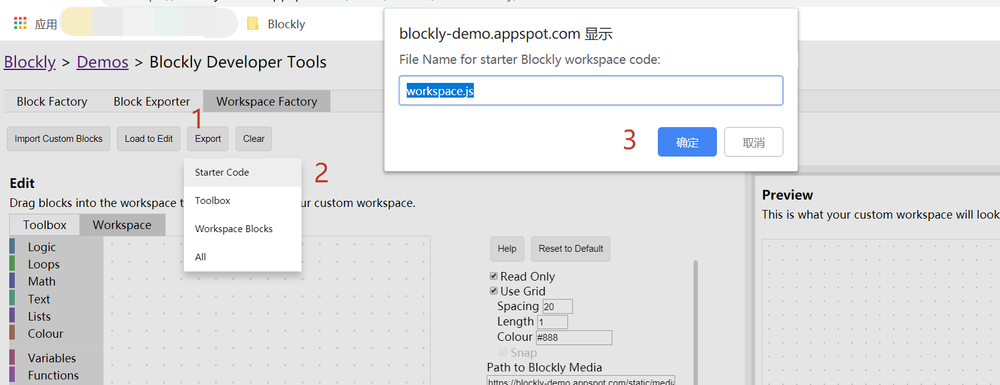

# 配置 第四

右文提及一些配置项，此处详细展开。如无特殊需求可以直接跳转文末查看 `Blockly Developer Tools` 的使用方法，将会简单很多。

### 网格

```
grid: {    spacing: 20,    length: 3,    colour: '#ccc',    snap: true}
```

依次代表格点间距，十字形格点的长短，格点颜色，以及是否自动将积木与网格对齐。

### 拖拽

```
move: {    scrollbars: {        horizontal: true,        vertical: true    },    drag: true,    wheel: false}
```

`scrollbars` 配置滚动。当传入的对象中键 `horizontal` 值为 `true` 时则显示水平滚动条。反之则禁止水平滚动条。`vertical` 对应垂直滚动条。

当向 `scrollbars` 传入一个布尔值，而非对象时，视作令 `horizontal` 和 `vertical` 都设为该布尔值。

只有 `scrollbars` 为 `true` 才能将 `drag` 设为 `true`。`drag` 代表是否允许鼠标拖拽移动 `WorkSpace` 。

只有 `scrollbars` 为 `true` 才能将 `wheel` 设为 `true`。`wheel` 代表是否允许鼠标滚轮移动 `WorkSpace` 。

### 缩放

```
 zoom: {     controls: true,     wheel: true,     startScale: 1.0,     maxScale: 3,     minScale: 0.3,     scaleSpeed: 1.2,     pinch: true }
```

依次为右下角是否显示缩放图标，是否允许滚轮缩放，起始大小比例，允许缩放的最大、最小大小比例，缩放速率，和移动设备是否允许二指缩放。

### `Blockly Developer Tools` 生成配置

首先打开 `Blockly Developer Tools`，之后按图示方法操作：



中间一列可供勾选的选项，就是右文翻译的那些配置项。只要点击启用禁用，调整网格、拖拽等配置项的参数，就可以即时地在右侧的预览中看到效果。根本不需要完全在字面上理解配置项的含义。



此后单击 `Export`，单击 `Starter Code`，就导出了 `WorkSpace` 的配置项。可以看到，在这个文件中，配置项已经生成好了。
