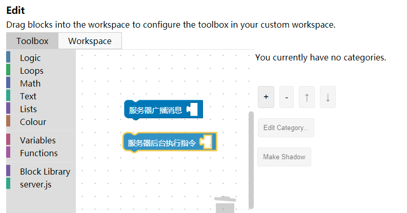
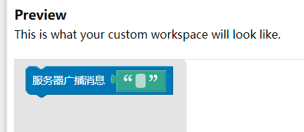

# ToolBox 编写与序列化 第八

编写完成积木后需要将它置于左侧 `ToolBox` 中 以便使用。`ToolBox` 的语法和 `WorkSpace` 序列化后的 `XML` 或 `JSON` 的语法是完全相同的。只需要删除所有的 `ID` 和坐标即可。本教程只涉及使用 `XML` 定义 `ToolBox` 。

原生积木有七个分类，分别是逻辑、循环、数学、字符串、列表、颜色、变量和函数。变量和函数是所谓的动态分类，与其他分类不同。函数分类的内部名字全为 `procedure`，但积木作 `function` 。如果要生成原生的分类，只需要按加号，然后点选 `Standard ToolBox` ，即自动生成包括了所有原生积木的 `ToolBox` 。

一个非动态分类例子：

```
<category name="分类名字" colour="#525288">
    <block type="hello_world">
    </block>
</category>
```

如果积木比较复杂，则需要给 `mutation` 、`field` 等赋初值。否则可能会在 `FlyOut` 内出现不合法状态以及显示问题。

### Blockly Developer Tools 中的 ToolBox 编辑功能

右文介绍了 `WorkSpace` 功能，用来编辑 `WorkSpace` 的属性（如背景网格样式等）。这些配置项会被导出为一个 `.js` 文件。而 `Developer Tools` 还附带了一个编辑 `ToolBox` 的功能。左侧是搭建区，右侧是预览区。在左侧随意放置一个积木，就可以将它加入默认分类里。



积木来源，可以是在左侧加载 `.xml` 形式导出的积木外观，也可以是自定义的 `.js` 文件。在左侧加载的 `Library` 同时仅能存在一个，因此使用较为不便。而加载自定义 `.js` 文件时，该文件必须仅包含对外观的定义，不能包含代码生成器，否则无法加载。

### 积木的 Input 初值

可以在左侧区域拖拽组合积木，以便为 `Input` 赋初值。`Field` 同理。




```
  <block type="server_broadcastmessage">    <value name="TEXT">      <block type="text">        <field name="TEXT"></field>      </block>    </value>  </block>
```

### Shadow Block

将 `<block>` 改为 `<shadow>` 即可实现阴影效果。如图


```
    <block type="server_broadcastmessage">
    <value name="TEXT">
      <block type="text">
        <field name="TEXT"></field>
      </block>
    </value>
  </block>
```

### 摆脱 Blockly Developer Tools

如果积木的代码生成器和外观在同一个文件内，则不便使用 `Blockly Developer Tools` 。此时可以使用另外的办法。右文提及，`ToolBox` 的格式实际上与积木序列化后的格式一致，只是去掉了 `id` 和坐标信息。那么，可以首先编写一个分类，并简单地加上积木，比如：

```
<category name="someCategory">
    <block type="a"></block>
    <block type="b"></block>
    <block type="c"></block>
</category>
```

然后将这些积木一块一块拖入 `WorkSpace` 中，配好默认值，自动生成了 `mutation`，最后将序列化后的 `XML` 去掉 `id` 等信息，即为 `ToolBox`。

序列化 `WorkSpace` 的代码如下所示：

```
Blockly.Xml.workspaceToDom(workspace);
```

反序列化的代码如下所示：

```
      var xml_text = '<xml xmlns="https://developers.google.com/blockly/xml"><block type="procedures_defnoreturn" id="g:FJeZ#!Yc3xz/KNU8ZO" x="40" y="30"><field name="NAME">main</field><comment pinned="false" h="80" w="160">function main...</comment></block></xml>';
      var xml = Blockly.Xml.textToDom(xml_text);
      Blockly.Xml.domToWorkspace(xml, workspace);
```

这样就向 `workspace` 内添加了一个函数积木。如果要覆盖当前已有的积木，可以清空 `WorkSpace`：

```
      workspace.clear();
```

### ToolBox 的应用

示例项目采用最简单的办法。在 `index.html` 内加一个 `toolbox` ，然后在注入时指向它。当然也可以直接传入一个字符串作为 `ToolBox`。如：

```
{toolbox: '<xml>...</xml>'}
```

如果使用 `JSON`，还可以直接传入 `JavaScript` 对象，如以下摘自官方教程的代码：

```
var toolbox = {
    "kind": "flyoutToolbox",
    "contents": [
      {
        "kind": "block",
        "type": "controls_if"
      },
      {
        "kind": "block",
        "type": "controls_whileUntil"
      }
    ]
  };
var workspace = Blockly.inject('blocklyDiv', {toolbox: toolbox});
```

使用 `JSON` 定义 `ToolBox` 和完成序列化的方法，此处不赘。
