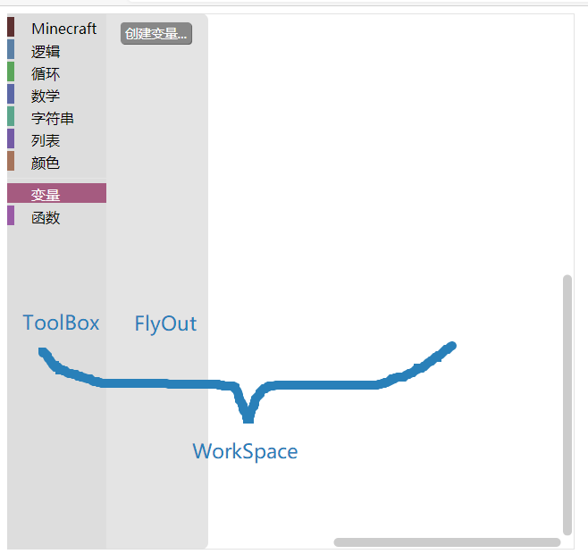
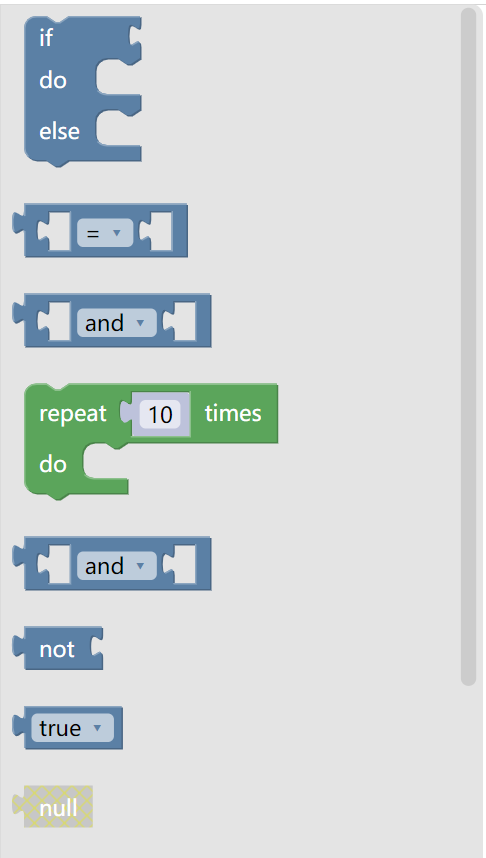

# 注入 第三

将 `Blockly` 可视化编辑器显示在网页内的过程被称为注入。注入的过程有很大的自定义余地。

注入的代码一般而言形如：

```javascript
const workspace = Blockly.inject(location, options);
```

其中返回的 `WorkSpace` 对象，就是可视化编辑器的对象。

猜测足下对于 `WorkSpace` 的刻板印象，可能是一个较大的方框。左边一排“货架”上摆满了取之无禁用之不竭的积木。右侧有一片用来搭积木的场地，把“货架”上的积木拖到右侧就可以编写代码。再专业些，这个大方框可以被称为 `WorkSpace` ，而这个“货架”可以被称为 `ToolBox`。似乎这是可视化编辑器最基础的结构。



以上是一个完整的 `WorkSpace` 。左侧包含了 逻辑、循环 等积木类别的竖栏即为 `ToolBox` 。点击 `ToolBox` 之后在右侧显示的，供用户选取积木的部分称为 `FlyOut` 。右侧搭建积木的空白区域和左侧 `ToolBox` 、`FlyOut` 共同组成 `WorkSpace` 。

`ToolBox` 划分为多个 `Category` 。逻辑、循环等是 `Google Blockly` 自带的原生 `Category` 。变量、函数是较为特殊的 `Category` ，因为它们包含的积木是可变的（添加多个变量或函数后，`Category` 的内容发生改变）。在“颜色”和“变量”之间有一道空隙将二者隔开，称之为 `Separator` 。

然而基础结构也可以有很多变化。 `ToolBox` 可以不存在。如果在 `WorkSpace` 内加上一些积木，就形成了一个展示区域。`Toolbox` 可以显示在右边，以方便从一些右至左书写的语言。同一个页面内可以把一个 `WorkSpace` 作为编辑器的主体，也可以有任意多个 `WorkSpace` 。通过多个 `WorkSpace` 的恰当组合，可以实现编程教学的效果。考虑一篇编程开发的教学文章，总是有代码示例，那么采用 `Blockly` 进行教学，又怎会不涉及多个 `WorkSpace` 呢？

本文主要介绍的编写方式，或许更符合刻板印象。但掌握了编辑器的编写方式，亦能写出一个展示区域。

## 注入

```javascript
const options = {
    toolbox: document.getElementById('toolbox'),
    media: 'media/'    
};
const workspace = Blockly.inject('blocklyDiv', options);
```

此即注入的一个简单实例。配置项有很多，将在下方一一翻译。最简单的方式（即示例项目采用的方式）是在 `HTML` 页面中写一个 `<xml>` 标签作为 `ToolBox` ，再把 `Blockly` 注入到一个 `<div>` 当中。`ToolBox` 的编写将会在左文提及。此处提供一个简单的 `ToolBox` 供测试使用。所使用的积木全为官方自带的原生积木。

```xml
<xml xmlns="https://developers.google.com/blockly/xml" id="toolbox" style="display: none">
    <block type="controls_ifelse">
    </block>
    <block type="logic_compare"></block>
    <block type="logic_operation"></block>
    <block type="controls_repeat_ext">
        <value name="TIMES">
            <shadow type="math_number">
                <field name="NUM">10</field>
            </shadow>
        </value>
    </block>
    <block type="logic_operation"></block>
    <block type="logic_negate"></block>
    <block type="logic_boolean"></block>
    <block type="logic_null" disabled="true"></block>
    <block type="logic_ternary"></block>
    <block type="text_charAt">
        <value name="VALUE">
            <block type="variables_get">
                <field name="VAR">text</field>
            </block>
        </value>
    </block>
</xml>
```


## 配置项翻译

右文注入时只使用到 `toolbox`  和 `media` 这两个配置项。其他配置项翻译如下：

| 配置项名                  | 类型                        | 简介                                                                                                                             |
| --------------------- | ------------------------- | ------------------------------------------------------------------------------------------------------------------------------ |
| `collapse`            | `boolean`                 | 是否允许折叠。即右键积木后会不会显示 `Collapse Block` 的选项。                                                                                       |
| `comments`            | `boolean`                 | 是否允许为积木添加注释。即右键积木后会不会显示 `Add Comment` 的选项。添加注释后积木左上角显示问号。                                                                      |
| `css`                 | `boolean`                 | 如果为 `false` 则不注入 `css`。默认为 `true`。                                                                                             |
| `disable`             | `boolean`                 | 是否允许禁用积木。即右键积木后会不会显示 `Disable Block` 的选项。                                                                                      |
| `grid`                | `object`                  | 配置网格。见左文。                                                                                                                      |
| `horizontalLayout`    | `boolean`                 | 如果为 `false` 则 `ToolBox` 将垂直显示。如果为 `true` 则 `ToolBox` 将水平显示。即 `ToolBox` 显示在左右，还是显示在上下。默认为 `false` 。                             |
| `maxBlocks`           | `number`                  | `WorkSpace` 内最大可放置的积木数量。默认 `Infinity`。（一般用于习题）                                                                                 |
| `maxInstances`        | `object`                  | 某一种积木最大可放置数量。如可以限制最多放 10 块“创建空列表”积木。默认 `Infinity`。（一般用于习题）                                                                     |
| `media`               | `string`                  | `Blockly` 的影音文件（如回收站图标、积木搭建声音等）路径。默认 `"https://blockly-demo.appspot.com/static/media/"`。注意默认网址在国内无法打开。                         |
| `move`                | `object`                  | 配置拖拽行为。见左文。                                                                                                                    |
| `oneBasedIndex`       | `boolean`                 | 列表积木将 0 还是 1 作为第一项的序号。默认 `true`，即 1 作为第一项序号。                                                                                   |
| `readOnly`            | `boolean`                 | 是否只读。默认 `false`。如果为 `true` 则禁止使用 `ToolBox` 和 回收站。防止一切修改。                                                                       |
| `renderer`            | `string`                  | 配置渲染器。自带了三种： `'geras'` (默认)，`'thrasos'` ，和 `'zelos'` 。                                                                         |
| `rtl`                 | `boolean`                 | 从右至左显示。默认为 `false` 。如果使用从右至左书写的语言可以设为 `true` 。                                                                                 |
| `scrollbars`          | `object` 或 `boolean`      | 见 `move` 。                                                                                                                     |
| `sounds`              | `boolean`                 | 默认 `true`。如果为 `false` 则不播放声音。                                                                                                  |
| `theme`               | `Theme`                   | 配置主题。见左文。                                                                                                                      |
| `toolbox`             | `string` , `XML` 或 `JSON` | 指定 `ToolBox` 。见左文。                                                                                                             |
| `toolboxPosition`     | `string`                  | `ToolBox` 的位置。默认`"start"`。当从左至右显示且垂直显示 `ToolBox` 时，`ToolBox` 显示在左侧。当水平显示 `ToolBox` 时，显示在上方。如果此项设置为 `"end"` 则 `ToolBox` 将显示在对侧。 |
| `trashcan`            | `boolean`                 | 是否显示回收站。                                                                                                                       |
| `maxTrashcanContents` | `number`                  | 回收站内最大积木数量。设为 0 则停用回收站，默认 32。                                                                                                  |
| `plugins`             | `object`                  | 配置插件。见左文。                                                                                                                      |
| `zoom`                | `object`                  | 配置缩放功能。见左文。                                                                                                                    |

\\
